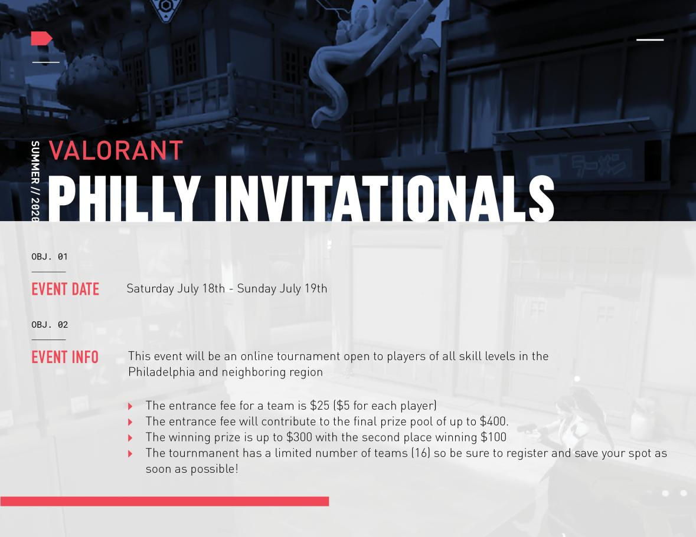

<h1> VALORANT Philly Invitational </h1>

<h2> Who Are We? </h2>
We are a group of recently graduated and current university students from Philadelphia! We all met through a shared passion for gaming, and VALORANT is the latest game that has caught our eye. We love this game so much, that we decided to run a tournament for fellow gamers in the Philadelphia area.

<h2> How Do I Register My Team? </h2>
To register your team, you can signup your team at the following link: <a href="https://forms.gle/pVTRymbMVmpsKPtz6">Signup Link</a>. While only the captain of the team inputs most of your team information, all members of a team are required to signup so we can get your IGN and signature on a release form.

<h2> Why Do I Have to Pay for this Tournament? </h2>
Since we are all broke college students, any prize pool money would have to come from registration fees. Don't worry, however - all money from the registration fees goes to the prize pool. If all eight teams register and do not cancel, the final prize pool will amount to $200, with 75% going to the winner and 25% going to second place. In the case that we cannot find eight teams or a team cancels last minute, the prize pool may decrease - the percentage the winning team and second place team gets does not change, however.

You might also wonder why we require at least half the deposit up front during registration. Since we anticipate many teams would like to participate in the Philly Invitationals, we require a deposit so that teams will not sign up for one of the limited spots in the tournament and then cancel before the tournament starts. This way, we can ensure that we can get the most teams as possible in the tournament! Please note that any cancellations after 7/15, or three days before the start of the tournament, will cause us not to refund your deposit.

<h2> How Can I Reach Out to You? </h2>
If you'd like to reach out to us with any questions, concerns, or business inquiries, please reach out to us at <a href="mailto:{{ site.email }}">{{ site.email }}</a>. We're new at the tournament process, so feel free to hit us up with any constructive criticism you may have!